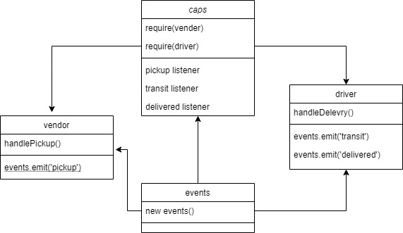

# caps
 system that emulates a real world supply chain. this will be an event driven application that “distributes” the responsibility for logging to separate modules, using only events to trigger logging based on activity.

A real-time service that allows for vendors, such as flower shops or restaurants, to alert a system of a package needing to be delivered, for drivers to instantly see what’s in their pickup queue, and then to alert the vendors as to the state of the deliveries (in transit, and then delivered).

## Setup
- .env requirements
store name 
- Running the app
npm start

## UML
